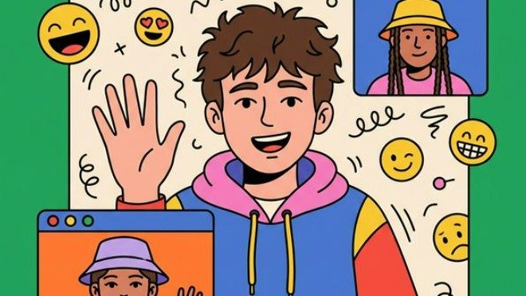

<div align="center">

# 🧠 UniTalks — India's College-Only Peer Social Space

### *A Safe, Anonymous, Real-Time P2P Campus Communication & Collaboration Platform*

<br>

🌐 **[Live App (AWS Lightsail)](https://unitalks.j9m8cp1zn4j6g.us-east-1.cs.amazonlightsail.com)** &nbsp;|&nbsp; 🎬 **[MVP Demo Video (YouTube)](https://youtu.be/RTatUVS6jGQ)** *(formerly ideated as Gingr)*

<br>

[](https://react.dev)
[](https://webrtc.org)
[](https://typescriptlang.org)
[](https://nodejs.org)

<br>

**UniTalks is a modern, privacy-first peer-to-peer communication platform built exclusively for verified college students in India. Fostering authentic connections and positive mental wellness, the platform combines anonymous high-quality voice/video chat, collaborative workspaces, and regional accessibility (including native Indian Sign Language integration) in a judgment-free virtual space.**

[🚀 Getting Started](#-getting-started) · [📖 How It Works](#-how-it-works) · [🏗️ System Architecture](#%EF%B8%8F-system-architecture) · [📊 Traction & Analytics](#-real-time-analytics--growth) · [🎬 Demo Video](#-demo-video) · [📈 Market Opportunity](#-market-opportunity--swot)

</div>

---

## 📌 Table of Contents

- [✨ Highlights](#-highlights)
- [💡 Why UniTalks?](#-why-unitalks)
- [🚀 Key Features](#-key-features)
- [📸 Project Gallery](#-project-gallery)
- [📊 Real-Time Analytics & Growth](#-real-time-analytics--growth)
- [🏗️ System Architecture](#%EF%B8%8F-system-architecture)
- [💻 Technology Stack](#-technology-stack)
- [🎨 Design System — "Amber Paper"](#-design-system--amber-paper)
- [📡 WebSocket Protocol](#-websocket-protocol)
- [📁 Repository Structure](#-repository-structure)
- [🚀 Getting Started](#-getting-started)
- [🛠️ Troubleshooting](#%EF%B8%8F-troubleshooting)
- [☁️ Deployment](#%EF%B8%8F-deployment)
- [🎬 Demo Video](#-demo-video)
- [📈 Market Opportunity & SWOT](#-market-opportunity--swot)
- [🤝 Contributing](#-contributing)
- [📄 License](#-license)

---

## ✨ Highlights

<table>
<tr>
<td width="100%">

🌐 **College-Verified Anonymous Space** — Only verified students join, ensuring campus safety and relatable interactions.

🔒 **Privacy-First Architecture** — Zero long-term data storage. High-quality P2P WebRTC media and data channels; no accounts and no database.

🎭 **Anonymous Avatar Profiles** — Students select whimsical animal characters (Fox, Panda, Tiger, etc.) and custom screen names to eliminate social pressure.

🎮 **Built-in Engagement Tools** — Real-time peer play with chess and visual interaction boosters.

🧑‍💻 **Code-Along Collaboration** — Shared real-time coding environments to build, debug, and learn together.

👑 **King-Queen Algorithm** — A silent backend reputation engine prioritizing verified positive contributors to keep the community healthy.

</td>
</tr>
</table>

### 🧭 What's in the codebase today

The list above is the product vision. If you're cloning this repo, here is what is actually
wired up right now versus what is still roadmap:

| Capability | Status |
|---|---|
| Anonymous 1-to-1 **text / voice / video** matching | ✅ Built — three FIFO queues, full WebRTC handshake |
| In-call chat, **reply-to-message**, emoji picker | ✅ Built — over the WebRTC data channel |
| **Chess** and **Listen Along** (synced music) | ✅ Built — peer-to-peer, via the FUN menu |
| Skip / Stop / re-queue, 30s queue timeout, skip rate-limit | ✅ Built |
| TURN relay for symmetric NAT | ✅ Built — active in production, STUN-only locally |
| Report Bug form | ✅ Built — submits via Web3Forms |
| College verification, avatar profiles, Google sign-in | 🚧 Roadmap — **no auth or accounts exist**; identity is an anonymous JWT |
| Code-Along collaborative workspace | 🚧 Roadmap |
| "King-Queen" reputation engine | 🚧 Roadmap |
| Analytics/traction figures below | 📊 Illustrative pitch material, not live telemetry |

---

## 💡 Why UniTalks?

Relocating for university or attending virtual classes often leads to isolation. Traditional platforms fail to address these unique challenges:

| ❌ The Problem | ✅ How UniTalks Solves It |
|---|---|
| **Loneliness Crisis**: Students struggle to build meaningful peer bonds in overwhelming university environments, causing stress. | **One-tap P2P Connections**: Spontaneous, pressure-free, and judgment-safe text, audio, and video routes to meet peers. |
| **Unsafe Platforms**: Random chat networks (like Omegle/OmeTV) lack safety checks, leading to toxic, unverified interactions. | **Verified College Access**: Safe, anonymous-yet-verified environment where users are confirmed peers. |
| **No Dedicated Campus Space**: No unified platform combines student anonymity, peer verification, and real-time interaction. | **College & City Hubs**: Hyper-local group chats for campus discussions, peer support networks, and city-wide student connections. |

### 🏆 Competitive Comparison Matrix

Traditional social and chat applications don't come close to offering a verified, anonymous, and collaborative experience tailored for Indian college students:

---

## 🚀 Key Features

- **Anonymous P2P Chat**: Establish encrypted 1-on-1 audio/video sessions or text rooms. Handled fully peer-to-peer via `simple-peer` WebRTC streams.
- **College & City Groups**: Join curated, location-centric peer groups for campus discussions, sharing localized recommendations, or organizing mock interviews.
- **Real-Time Code Along**: Integrated collaborative code editors for developers to program, debug, and mentor each other during live sessions.
- **Engagement Tools & Games**: Embedded "Play Along" mini-games (such as Chess, with Ludo & Tambola planned) and "Binge Along" watch parties to keep interactions dynamic.
- **Moderation & Safety (Privacy-First)**: Google Cloud Vision and WebPurify integration for NSFW scanning, zero long-term logging, and strict OAuth authentication.
- **King-Queen Matching Algorithm**: Backend reputation model scoring positive engagements to optimize high-match rates and foster positive community behavior.

---

## 📸 Project Gallery

### 💻 Student Experience & User Flow

<div align="center">

<br><em>Modern Student Landing Page</em>
<br><br>

<br><em>Multi-Modal Chat Selection (Text, Audio, Video)</em>
<br><br>

<br><em>Live Video Chat Experience</em>
</div>

---

## 📊 Real-Time Analytics & Growth

Unlike static school projects, UniTalks is a battle-tested platform with real market traction. Verified through Google Analytics metrics, the platform has achieved:

<table>
<tr>
<td width="50%">

### 📈 Key Metrics
- 👥 **30-Day Active Users**: **6,517+** engaged students.
- ⚡ **Platform Event Actions**: **98,620+** total events, including over **30,000+** engagement interactions and **5,900+** direct chat mode choices.
- 🚦 **Top Channels**: Highly organic, led by **Direct (886 sessions)** and **Organic Search (306 sessions)**.
- 🗺️ **Global Footprint**: Dominant engagement in India (677 active users) with expanding test users in the US (29), UK (6), and Germany (4).

</td>
</tr>
</table>

---

## 🏗️ System Architecture

UniTalks operates an offline-first signaling sequence with zero storage logs. The system orchestrates direct peer connections dynamically using WebSocket routing for high-efficiency WebRTC signaling.

### End-to-End WebRTC Signaling & P2P Stream

```
                                  ┌──────────────────┐
                                  │  Signaling Hub   │ (Node.js/TypeScript
                                  │ (WebSocket Server│  WS Service)
                                  └────────┬─────────┘
                                           │
                        1. Registration    │    2. Call Offer / Signaling
                           & User Match    │       Signal Exchange
                                           ▼
                 ┌──────────────────────────────────────────────────┐
                 ▼                                                  ▼
       ┌──────────────────┐                                ┌──────────────────┐
       │   Peer Client A  │◄──────────────────────────────►│   Peer Client B  │
       │ (SimplePeer SDK) │     3. Direct Peer-to-Peer     │ (SimplePeer SDK) │
       │     [REACT]      │         WebRTC Stream          │     [REACT]      │
       └────────┬─────────┘        (Audio, Video)          └────────┬─────────┘
                │                                                   │
                ├───────────► Built-in Chess Mini-Game (P2P Data) ◄─┤
                │                                                   │
                ├───────────► In-call Text Chat (P2P Data)       ◄──┤
                │                                                   │
                └───────────► Listen Along music sync (P2P Data) ◄──┘
```

1. **Auth**: the client POSTs to `/api/auth/token` for a short-lived anonymous JWT, then opens
   `wss://…/ws?token=…`. There is no login — the token identifies a socket, not a person.
2. **Queueing**: `{type:'join', mode}` puts the user in one of three FIFO queues
   (video / audio / text). Matching is strictly first-in-first-out **within the same mode**.
3. **Match & acknowledge**: the server pairs the two longest-waiting users, tells each one
   whether it is the `initiator`, and waits for both to `acknowledge` before marking the
   session ready.
4. **WebRTC handshake**: the initiator generates an SDP offer; offer, answer and ICE candidates
   are relayed through the WebSocket. ICE uses Google STUN plus TURN credentials fetched from
   `/api/turn` (time-limited, coturn REST scheme).
5. **P2P established**: audio, video **and the data channel** flow directly between peers. The
   server never sees media, chat messages, chess moves or music state.

---

## 💻 Technology Stack

### Frontend (Client)
- **Framework**: [React](https://react.dev) 18.2 on Create React App (`react-scripts` 5).
- **Routing**: [React Router DOM](https://reactrouter.com/) 6.22 — SPA routing, 10 routes.
- **P2P Audio/Video/Data**: `simple-peer` 9.11 — WebRTC abstraction over `RTCPeerConnection`.
- **Signaling client**: the browser's native `WebSocket`, wrapped in `src/utils/socketService.js`.
  > `socket.io-client` is still listed in `package.json` but **nothing imports it** — the
  > protocol is plain JSON over a raw WebSocket. Safe to remove.
- **Styling**: `styled-components` 6.1 with a theme injected at the root (`src/config/theme.js`).
- **Icons**: `react-icons` (Feather / `Fi*` set).
- **Games**: `chess.js` 1.4, driven over the WebRTC data channel.

### Backend (Server)
- **Runtime**: Node.js + TypeScript (compiled with `tsc` to `server/dist`).
- **HTTP**: Express — `/health`, `/api/auth/token`, `/api/turn`, plus an SPA fallback that
  serves the React build when one is present at `server/public`.
- **Signaling**: `ws` — one WebSocket server mounted at `/ws`.
- **Identity**: anonymous JWTs (`jsonwebtoken` + `uuid`). No accounts, no login, no database.
- **State**: entirely in-process `Map`s. Restarting the server clears every queue and session.

### Hosting & Infrastructure
- **Production**: a single **AWS Lightsail container service** (`unitalks`, nano, scale 1) in
  `us-east-1`, serving the React build *and* the API *and* the WebSocket from one origin — so
  there is no CORS and no mixed content.
- **Image registry**: Amazon ECR (`unitalks:latest`), built from the root `Dockerfile`
  (multi-stage: frontend build → backend build → slim runtime on `node:20-alpine`).
- **TURN relay**: coturn 4.18 on an EC2 `t3.micro` with an Elastic IP, for peers behind
  symmetric NAT.
- **Secrets**: AWS SSM Parameter Store (`/unitalks/JWT_SECRET`, `/unitalks/TURN_SECRET`),
  injected as container env vars at deploy time.

> **Scale must stay at 1.** Matchmaking state lives in memory, so a second container would
> split the pool and users on different instances could never be matched. Scaling out means
> moving `server/src/services/stateManager.ts` onto Redis first.

Full runbook: [`deployment/aws/RUNBOOK.md`](./deployment/aws/RUNBOOK.md).

---

## 🎨 Design System — "Amber Paper"

The UI is flat, high-contrast campus stationery: a sun-amber canvas with a 40px graph-paper
grid, paper-white slates, crisp 1.5px ink outlines and chunky ink buttons. No gradients,
no blur, no glow. Video and voice run on a dark ink canvas so the media still reads well.

Tokens live in [`src/config/theme.js`](./src/config/theme.js) and reach every component
through `styled-components`' `ThemeProvider`:

| Token | Value | Used for |
|---|---|---|
| `sun` | `#F9C74A` | page canvas, primary brand |
| `sunDeep` | `#F0B429` | pressed / active amber |
| `sunTint` | `#FDE9AE` | highlights, system notices |
| `ink` | `#1C1C1E` | dark canvas, buttons, headings, outlines |
| `inkSoft` | `#2C2C2E` | raised surface on dark |
| `paper` | `#FFFFFF` | cards and sheets |
| `paperAlt` | `#F7F7F8` | input wells, toolbars |
| `line` | `#E5E5EA` | hairline dividers |
| `muted` | `#8A8A8E` | secondary text, timestamps |
| `blue` | `#2D7FF9` | own chat bubbles, links, badge pins |
| `orange` | `#F59033` | emphasis, notification tags |
| `green` / `red` | `#34C759` / `#FF3B30` | live status / stop & disconnect |

Radii (`theme.radii`): `card` 28px · `panel` 20px · `bubble` 18px · `control` 14px · `pill` 999px.
Typeface: **Plus Jakarta Sans** (400–800), loaded in `public/index.html`.

Long-form pages (About, Privacy, Terms, Help, Contact) all share one set of primitives in
[`src/components/ui/ContentPage.js`](./src/components/ui/ContentPage.js) — edit that file to
restyle all five at once.

> ⚠️ **Two rules in `public/index.html` used to break this and must not come back.** An earlier
> theme forced `* { background-color: transparent !important }` and a hard-coded black
> `html/body/#root`. Both killed every solid fill. They are gone; don't reintroduce them.

---

## 📡 WebSocket Protocol

Connect to `ws(s)://<host>/ws?token=<JWT>`. One JSON object per frame, always with a `type`.
Missing token closes with `4001`, an invalid one with `4002`. The server pings every 15s and
`socketService` answers `pong` automatically.

**Client → Server**

| Message | Meaning |
|---|---|
| `{type:'join', mode?:'video'\|'audio'\|'text'}` | Enter the queue (omitted `mode` defaults to `video`) |
| `{type:'cancel'}` | Leave the queue while still searching |
| `{type:'acknowledge'}` | Confirm a match; when both ack, `session-ready` fires |
| `{type:'signal', signalType:'offer'\|'answer'\|'ice', data}` | Relay a WebRTC signal to the partner |
| `{type:'skip'}` | Drop the partner — **both** go to the back of the queue |
| `{type:'leave'}` | Exit; partner gets `partner-left` and is re-queued |
| `{type:'fun-request'\|'fun-accept'\|'fun-reject'\|'fun-exit', game}` | Chess / Truth-and-Dare / Listen Along handshake |

**Server → Client**

| Message | Meaning |
|---|---|
| `{type:'ready', userId}` | Socket authenticated |
| `{type:'queue', position}` | You are searching |
| `{type:'matched', partnerId, initiator, sessionId}` | Matched — `initiator: true` means you create the offer |
| `{type:'session-ready'}` | Both sides acknowledged |
| `{type:'signal', from, signalType, data}` | Partner's WebRTC signal |
| `{type:'partner-left'}` / `{type:'partner-skipped'}` | Partner disconnected / skipped you |
| `{type:'search-cancelled'}` · `{type:'error', message}` · `{type:'ping'}` | Housekeeping |

**Rules the UI must respect**
- Three independent FIFO queues (video / audio / text). You only match within the same mode.
- **Queue timeout is 30s** (`matchmaking.ts`) — a user waiting alone is silently dropped.
- Skip limit: 50 per 60s (`stateManager.ts`).
- **In-call chat, chess moves and music sync do *not* go through the server** — they travel
  over the WebRTC data channel (`peer.send`), so they only work once `isConnected` is true
  and nothing is persisted.

---

## 📁 Repository Structure

```
UniTalks-WebRTC-Video-Chat/
├── Dockerfile                        # Multi-stage build: frontend + backend → one image
├── package.json                      # Frontend deps & scripts
├── amplify.yml / buildspec.yml       # Legacy CI configs (not the live path)
│
├── docs/
│   ├── UI_REDESIGN_BRIEF.md          # Full architecture + "do not break" contract
│   └── STITCH_PROMPT.md              # Design-system prompts used for the UI
│
├── deployment/
│   └── aws/RUNBOOK.md                # ⭐ The live deployment procedure
│
├── public/
│   ├── index.html                    # Fonts, graph-grid CSS, global resets
│   └── assets/logos/                 # logo.png, favicon.png
│
├── src/
│   ├── index.js                      # React root + ThemeProvider
│   ├── App.js                        # Router; amber canvas, ink canvas on /video & /voice
│   ├── config/theme.js               # ⭐ Amber Paper design tokens
│   │
│   ├── utils/
│   │   ├── socketService.js          # ⭐ WebSocket + auth-token client (singleton)
│   │   ├── webrtcStun.js             # STUN list, TURN fetch, getRtcConfig()
│   │   ├── supportForm.js            # Help/Contact submission via Web3Forms
│   │   ├── chessEngine.js            # Chess rules for the in-call game
│   │   └── performanceOptimizations.js
│   │
│   └── components/
│       ├── layout/                   # Header.js, Footer.js
│       ├── pages/                    # ⭐ ALL 10 routed pages live here
│       │   ├── Homepage.js           # Landing (the only page with a Footer by design)
│       │   ├── StartChat.js          # Mode picker
│       │   ├── TextChat.js           # /text   — amber canvas
│       │   ├── AudioChat.js          # /voice  — ink canvas
│       │   ├── VideoChat.js          # /video  — ink canvas
│       │   └── About|Privacy|Terms|Help|Contact.js
│       └── ui/
│           ├── ContentPage.js        # ⭐ Shared kit for the 5 long-form pages
│           ├── ChessBoard.js         # Flat amber/white board
│           ├── ReportBugModal.js     # Bug report (submits via Web3Forms)
│           ├── AudioVisualizer.js    # Canvas voice-activity graph
│           └── UniversalHamburger.js # Mobile bottom-sheet nav
│
└── server/
    ├── Dockerfile · tsconfig.json · package.json
    └── src/
        ├── index.ts                  # ⭐ Express + WebSocketServer + message handling
        ├── config/{env,jwt}.ts       # Env loading (throws without JWT_SECRET) + JWT
        ├── routes/{auth,turn}.ts     # POST /api/auth/token, GET /api/turn
        ├── services/
        │   ├── matchmaking.ts        # FIFO matching, 30s queue timeout
        │   └── stateManager.ts       # In-memory users / sessions / queues
        └── types/index.ts            # The whole WS protocol as TS unions
```

> ⚠️ **`src/components/` also contains 8 stale top-level copies** of About, Contact, Help,
> Homepage, MaintenancePage, Privacy, StartChat and Terms. **Nothing imports them** — `App.js`
> only pulls from `src/components/pages/`. Editing the wrong copy is the single most common
> way to waste an hour here. `MaintenancePage.js` is unrouted in both locations.

---

## 🚀 Getting Started

### Prerequisites
- **Node.js 20+** (the production image is `node:20-alpine`) and npm
- A modern browser with camera/mic permissions for the video and voice modes

### 1. Clone and install

```bash
git clone https://github.com/AmolBhatia17/amazon-first-commit.git
cd amazon-first-commit

npm install                 # frontend
npm install --prefix server # backend
```

### 2. Configure environment

The backend **will not start without `JWT_SECRET`** — `server/src/config/env.ts` throws on boot.
Create `server/.env`:

```env
PORT=8080
NODE_ENV=development
JWT_SECRET=local-dev-secret-change-me
```

Optional backend vars: `CORS_ORIGIN` (unset = allow `*`), `TURN_SECRET`, `TURN_HOST`,
`TURN_TTL_SECONDS` (default `86400`).

The frontend needs no `.env` for local work — with `REACT_APP_API_URL` empty it auto-targets
`http://localhost:8080` on localhost and same-origin in production. Optionally create `.env`
in the repo root:

```env
REACT_APP_WEB3FORMS_KEY=your_web3forms_key   # Report Bug / Help / Contact forms
REACT_APP_API_URL=                           # leave empty for local dev
```

### 3. Run both services (two terminals)

```bash
# terminal 1 — signaling server on :8080
npm run dev --prefix server

# terminal 2 — React dev server on :3000
npm start
```

Open **http://localhost:3000**. Check the backend with `curl http://localhost:8080/health`.

### 4. Test a real match — you need two peers

Matchmaking pairs two *different* clients, so a single tab will just sit in the queue and get
dropped after 30 seconds.

1. Open `http://localhost:3000` in a **normal window** and again in an **incognito window**.
2. Pick the **same mode** in both (e.g. `/text` in each).
3. Click **Start Chat** in both. They should match within a second or two.
4. Send messages both ways, then try **Skip** and **Stop**.

> Without TURN configured locally, peers behind symmetric NAT will match and then show a black
> video. That is expected on localhost — it is not a UI bug.

### 5. Scripts

| Command | What it does |
|---|---|
| `npm start` | React dev server on :3000 with hot reload |
| `npm run build` | Production build into `build/` |
| `npm test` | CRA test runner |
| `npm run dev --prefix server` | Backend with `ts-node-dev` (hot reload) |
| `npm run build --prefix server` | Compile TypeScript to `server/dist` |
| `npm start --prefix server` | Run the compiled backend |
| `npm run type-check --prefix server` | Type-check without emitting |

---

## 🛠️ Troubleshooting

**Backend exits immediately with `JWT_SECRET environment variable is required`**
Create `server/.env` as in step 2. This is intentional — it refuses to run with no signing key.

**`npm error enoent spawn C:\WINDOWS\system32\cmd.exe` (Windows)**
`cmd.exe` is missing from `System32` on some machines, so npm cannot spawn a shell. Either
point at the 32-bit copy for the session:

```powershell
$env:ComSpec = "C:\Windows\SysWOW64\cmd.exe"
```

…or run the binaries directly, bypassing npm scripts:

```powershell
node server\dist\index.js                              # backend (after a build)
node node_modules\react-scripts\bin\react-scripts.js start   # frontend
```

Worth repairing properly with `sfc /scannow` from an elevated prompt.

**Two tabs never match** — they must be in the **same mode**, and the queue drops a lone
waiter after 30s. Use one normal + one incognito window; two tabs in the same profile share
the same session storage but do get separate tokens, so either works.

**Camera/mic blocked** — the page shows "Camera blocked. Please enable it and try again."
Grant permission in the browser's site settings; `getUserMedia` only works on `localhost` or
HTTPS.

**Restarting the backend drops everyone** — expected. All queues and sessions are in memory.

---

## ☁️ Deployment

Production is one Lightsail container serving frontend + API + WebSocket from a single origin.
The short version (full detail, including the AWS gotchas, is in
[`deployment/aws/RUNBOOK.md`](./deployment/aws/RUNBOOK.md)):

```powershell
$env:AWS_PROFILE = "unitalks"; $env:AWS_DEFAULT_REGION = "us-east-1"

# 1. build the all-in-one image
docker build -t unitalks:latest .

# 2. smoke-test it locally first
docker run -d --name uttest -p 8098:8080 -e JWT_SECRET=localtest unitalks:latest
curl http://localhost:8098/health
docker rm -f uttest

# 3. push to ECR, then 4. roll out the Lightsail deployment
#    (both steps are scripted verbatim in the runbook)
```

Then verify: `GET /`, `GET /health`, `GET /api/turn`, `POST /api/auth/token`, and a WebSocket
handshake that should answer `{"type":"ready", ...}`.

A deployment takes ~3–5 minutes. Secrets come from SSM at deploy time, so **rotating a secret
means redeploying**.

---

## 🎬 Demo Video

Our MVP demonstration highlights the full student onboarding journey: anonymous profile initialization, college matchmaking, live WebRTC audio/video connections, and real-time interaction capabilities.

<div align="center">

[](https://youtu.be/RTatUVS6jGQ)

*▶️ Click to watch the live platform MVP demo on YouTube*

</div>

---

## 📈 Market Opportunity & SWOT

To demonstrate the commercial and strategic potential of the UniTalks product model, we mapped out its growth variables:

### 📐 Market Sizing
* **Total Addressable Market (TAM)**: **380M+** higher-education students worldwide seeking private, safe campus social spaces (Social platforms CAGR >20%).
* **Serviceable Addressable Market (SAM)**: **43M** Indian college students (Gen Z & Alpha). India's overall social market is projected at ₹60,000 Cr by 2025.
* **Serviceable Obtainable Market (SOM)**: **5M** active users targeted by Year 2 via NGOs, campus ambassadors, D2C rollouts, and institutional tie-ups.

### 📊 SWOT Matrix

| 🟢 Strengths | 🔴 Weaknesses |
|---|---|
| • Only college-verified anonymous platform in India.<br>• Multi-modal engagement (P2P video, Chess, Code Along).<br>• Zero data retention ensures privacy.<br>• King-Queen algorithm improves user retention. | • Early prototype stage (scalability tests ongoing).<br>• Initial monetization dependent on ad density.<br>• Real-time content moderation at high user volumes is costly. |
| **🔵 Opportunities** | **🟡 Threats** |
| • RPwD / Digital India institutional collaborations.<br>• Regional language expansion.<br>• SE Asia campus rollout by Year 3.<br>• API licensing to ed-tech platforms. | • Free tool erosion by legacy systems (Google Meet/Meta).<br>• User churn if viral retention loops fail.<br>• Stringent regional data regulations (e.g., DPDP Act). |

---

## 🤝 Contributing

Contributions are welcome! Please follow these guidelines:

1. **Fork** the repository.
2. **Create** a feature branch: `git checkout -b feature/your-feature-name`
3. **Commit** your changes: `git commit -m 'Add some feature'`
4. **Push** to the branch: `git push origin feature/your-feature-name`
5. **Open** a Pull Request.

### Conventions worth knowing before your first PR

- **Edit `src/components/pages/`, never the stale top-level copies** in `src/components/`
  (see the note under *Repository Structure*).
- **Restyle, don't restructure, the chat pages.** `VideoChat.js` and `AudioChat.js` define
  ~80 styled-components each at the top of the file; changing those is low-risk. The JSX
  below them is load-bearing — see the "functionality contract" in
  [`docs/UI_REDESIGN_BRIEF.md`](./docs/UI_REDESIGN_BRIEF.md) §9. In particular:
  - `localVideoRef` / `remoteVideoRef` / `remoteAudioRef` / `musicAudioRef` must stay on real
    `<video>` / `<audio>` elements, and the remote video must **stay mounted** while
    disconnected (it is hidden with `visibility`, and the stream is re-attached to that node).
  - Every `socketService.on(...)` needs its matching `off(...)` in the effect cleanup, or you
    get duplicate handlers and duplicated messages.
  - The Stop button is dual-purpose — `isWaiting && !isConnected ? cancelSearch : stopChat`.
    Keep that conditional.
- **Design tokens go in `src/config/theme.js`**, not hardcoded hex values.
- The three chat pages carry `/* eslint-disable react-hooks/exhaustive-deps */` deliberately;
  "fixing" the dependency arrays can cause reconnect loops.
- **Always test a real match with two browser windows** (one normal, one incognito) before
  opening a PR — a single tab cannot exercise the matchmaking path.

---

<div align="center">

**⭐ If you like UniTalks, please give this repository a star!**

*Built with ❤️ for accessible, safe, and collaborative campus spaces.*

</div>
....................................................................................